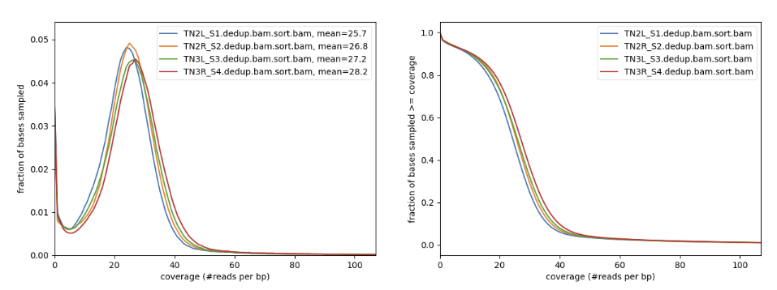

# Gynandromorph 2024
### Authors:
Krista Pipho, Avi Heyman, Angie Huang, Daniel Levin, and Shriya Minocha 

# Description
This Snakemake pipeline aids in the analysis of full-genome sequencing data from an H. melpomene gynandromorph specimen. The pipeline can also be implemented for other butterfly species as long as 4 paired-end reads (one genome sequence for each leg) are provided. After prepping a reference genome, the workflow begins by generating BAM files of the deduplicated sample reads, along with running quality control and creating a full-genome coverage plot. Then the pipeline generates per-sample and joint-called VCF files. To reduce background noise, the VCFs will be filtered down to just include SNPs (no multiallelic sites, indels, etc). Finally, the variants are phased and specific chromosomes can be extracted for further analysis. A more in depth explanation of each step in the pipeline can be found in Rule Explanations.

More specifically, the Gynandromorph pipeline accepts FASTA/FASTQ sequences as **inputs** and generates the following **outputs**:

* **BWA Alignment**: Aligns the FASTA/FASTQ sequences with a reference genome **(BAM)**
* **BAM Quality Control**: Generates flagstats of deduplicated BAMs **(TXT)**
* **Coverage Plot**:  Depicts sequencing coverage of genome **(PNG)**
* **Variant Calling (SNPS)**: Isolates SNPs, reduces background noise **(VCF)**
* **Haplotagged BAM**: Tags BAM files with an indicator of which chromosome it originated from **(BAM)**

# Running the Pipeline
### Requirements

To run the pipeline, Miniconda or Anaconda must be installed on your computer. Follow the steps below:

1. Download the Miniconda Installer for your operating system from the official website: [https://docs.anaconda.com/miniconda/install/](https://docs.anaconda.com/miniconda/install/)
2. Navigate to the bottom of the website until you see the "Quick Command Line Install" section
3. Follow the steps for your operating system (Windows, macOS, or Linux)
4. Run `conda --version` in your terminal to ensure that Miniconda has been installed

### Security: SSH key generation and DCC -> Github connection
  
1. Login to DCC using `$ ssh netid321@dcc-login.oit.duke.edu`
2. Generate SSH key using `$ ssh-keygen` and select default file location
3. Go to your Github profile and select "SSH Keys" from left sidebar 
4. "Add SSH Key" and enter the id_rsa.pub file contents into the "Key" field, and "Add Key"
 

## Getting Started

### Cloning the Pipeline

1. The pipeline is accessible in this [Github repo](https://github.com/Krista-Pipho/gynandromorph_2024.git). The repository contains everything you will need to run the pipeline
2. Open your terminal window and log into DCC using `$ ssh netid321@dcc-login.oit.duke.edu`
3. Clone the repository using `git clone https://github.com/Krista-Pipho/gynandromorph_2024.git`
4. Once it is fully cloned, enter the repository directory using `cd gynandromorph_2024`
 

### Creating the Environment

5. The pipeline can only be run inside of an environment that contains all of the necessary packages. The following steps will describe how to implement the environment on your own terminal
6. The environment will be stored in the src folder. Enter this folder by using `cd /gynandromorph_2024/src`
7. Run `$ conda create --name myenv --file illumina_pipeline_environment.txt`
8. The text file will now contain all of the packages required to run the pipeline
 

### Activating the Environment

9. Use `conda activate myenv` to enter the environment
  

  

# Simple Use Case

  

Using the sample butterfly genome given found in /gynandromorph_2024/src/SRR13577847.p_ctg.fa, we will go through a sample run of the pipeline and its rules (processes).

1. Run `$ snakemake --dry-run` to test if workflow is properly installed and estimate the amount of needed resources. This --dry-run flag evaluates the rules without running the actual commands, and also created a DAG image (/gynandromorph_2024/src/rulegraph.png) that shows the workflow of all rules. 

2. If on a cluster, the pipeline DAG image (and also any other files) can be viewed by pulling the file from shell to your local computer. Enter the terminal on your local computer and use the command `$ scp netid321@dcc-login.oit.duke.edu:/path/to/genome_2024/src/rulegraph.png /local/path/to/save`
3. If no errors arise with the dry run, run `$ sbatch launch.sh` while inside the src folder. This file is a wrapper to run the Snakemake commands, found in the Snakefile within the src folder.
4. If on SLURM, run `squeue -u userID` to view the job process.
5. Open the corresponding slurm log to monitor the live process output

  

## Rule Explanations

Here is a breakdown of how each Snakemake rule functions and what outputs you should be seeing as you run the Simple Use Case.

  

The pipeline executes the following steps in order:

1. BWA Align

2. Alignment Quality Control

3. Plot Coverage

4. Variant Calling

5. Variant Quality Control

6. Targets

 

### BWA Align

The goal of BWA Align is to index the reference genome, align paired-end reads, and creates BAM files for each of the samples.

 

 

### Alignment Quality Control

The goal of Alignment Quality Control is to removes duplicate sequences using the Picard module and to generates stats such as # of reads and read quality. `samtools.flagstat` can be used to do a quality check of the deduplicated bam files. For example, these are the results you should see when you run the code `samtools.flagstat SRR31620076.dedup.bam` in the terminal:

*INSERT ACTUAL OUTPUT HERE*

56997586 + 0 in total (QC-passed reads + QC-failed reads)  
2146542 + 0 secondary  
0 + 0 supplementary  
4967653 + 0 duplicates  
53068116 + 0 mapped (93.11% : N/A)  
54851044 + 0 paired in sequencing  
27425522 + 0 read1  
27425522 + 0 read2  
45302230 + 0 properly paired (82.59% : N/A)  
50185440 + 0 with itself and mate mapped  
736134 + 0 singletons (1.34% : N/A)  
4161666 + 0 with mate mapped to a different chr  
2176897 + 0 with mate mapped to a different chr (mapQ>=5)  

As we can see, the number of duplicates has reduced down to 0, signalling that the deduplication rule worked as intended.

 

 

### Plot Coverage

By generating a coverage plot of the indexed BAM files, we can gain more information about the distribution of sex chromosomes within the  specimen.
This is the coverage plot that should be generated by the pipeline:

 

 

### Variant Calling

The goal of Variant Calling is to use GATK to locate potential SNPs and generates VCFs for all four legs genomes. This step will generate two types of VCFs: per sample VCFs, and joint called VCFs. 

 

 

### Variant Quality Control

The main goal of Variant Quality Control is to filter the VCFs by removing indels and multiallelic sites, along with generating VCF stats and plots using BCFTools to ascertain filtering quality.

 

 

### Haplotypes

 

# Resources

# References
