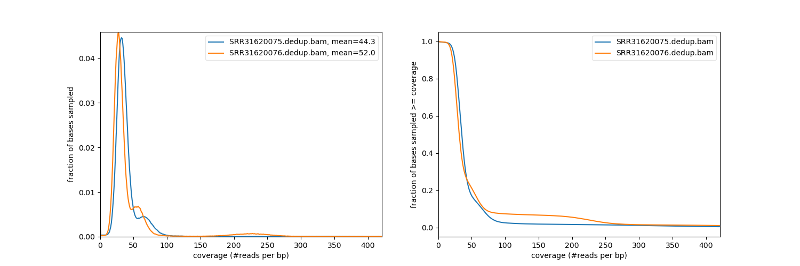

# Gynandromorph 2024
### Authors:
Krista Pipho, Shriya Minocha, Angie Huang, Daniel Levin, and Avi Heyman 

# Description
This Snakemake pipeline aids in the analysis of full-genome sequencing data from an H. melpomene gynandromorph specimen. The pipeline can also be implemented for other sibling species as long as multiple paired-end reads (at least one FASTQ sequence for each sibling) are provided. After prepping a reference genome, the workflow begins by generating BAM files of the deduplicated sample reads. Next, it will run quality control and create a full-genome coverage plot. Then the pipeline generates per-sample and joint-called VCF files. To reduce background noise, the VCFs will be filtered down to just include SNPs (no multiallelic sites, indels, etc). Finally, the variants are phased and specific chromosomes can be extracted for further analysis. A more in depth explanation of each step in the pipeline can be found in Rule Explanations.

More specifically, the Gynandromorph pipeline accepts FASTA/FASTQ sequences as **inputs** and generates the following **outputs**:

* **BWA Alignment**: Aligns the FASTA/FASTQ sequences with a reference genome **(BAM)**
* **BAM Quality Control**: Generates flagstats of deduplicated BAMs **(TXT)**
* **Coverage Plot**:  Depicts sequencing coverage of genome **(PNG)**
* **Variant Calling (SNPS)**: Isolates SNPs, reduces background noise **(VCF)**
* **Haplotagged BAM**: Tags BAM files with an indicator of which chromosome it originated from **(BAM)**

# Running the Pipeline
### Requirements

To run the pipeline, Miniconda or Anaconda must be installed on your computer. Follow the steps below:

1. Download the Miniconda Installer for your operating system from the official website: [https://docs.anaconda.com/miniconda/install/](https://docs.anaconda.com/miniconda/install/)
2. Navigate to the bottom of the website until you see the "Quick Command Line Install" section
3. Follow the steps for your operating system (Windows, macOS, or Linux)
4. Run `conda --version` in your terminal to ensure that Miniconda has been installed

### Security: SSH key generation and DCC -> Github connection
  
1. Login to DCC using `$ ssh netid321@dcc-login.oit.duke.edu`
2. Generate SSH key using `$ ssh-keygen` and select default file location
3. Go to your Github profile and select "SSH Keys" from left sidebar 
4. "Add SSH Key" and enter the id_rsa.pub file contents into the "Key" field, and "Add Key"
 

## Getting Started

### Cloning the Pipeline

1. The pipeline is accessible in this [Github repo](https://github.com/Krista-Pipho/gynandromorph_2024.git). The repository contains everything you will need to run the pipeline
2. Open your terminal window and log into DCC using `$ ssh netid321@dcc-login.oit.duke.edu`
3. Clone the repository using `git clone https://github.com/Krista-Pipho/gynandromorph_2024.git`
4. Once it is fully cloned, enter the repository directory using `cd gynandromorph_2024`
 

### Creating the Environment

5. The pipeline can only be run inside of an environment that contains all of the necessary packages. The following steps will describe how to implement the environment on your own terminal
6. The environment will be stored in the src folder. Enter this folder by using `cd /gynandromorph_2024/src`
7. Run `$ conda create --name myenv --file illumina_pipeline_environment.txt`
8. The text file will now contain all of the packages required to run the pipeline
 

### Activating the Environment

9. Use `conda activate myenv` to enter the environment
  

  

# Simple Use Case: Step-By-Step Tutorial

  

While the pipeline might seem complex, this section will provide a step-by-step tutorial of how it all works. We will go through a sample run of the pipeline and its rules (processes). More specifically, we will walk through the simple analysis of two sibling yeast genomes using the pipeline and a reference yeast genome, SRR13577847.p_ctg.fa. 

1. Run `$ snakemake --dry-run` to test if workflow is properly installed and estimate the amount of needed resources. This --dry-run flag evaluates the rules without running the actual commands, and also created a DAG image (/gynandromorph_2024/src/rulegraph.png) that shows the workflow of all rules. 

2. If on a cluster, this pipeline DAG image (and also any other files) can be viewed by pulling the file from shell to your local computer. Enter the terminal on your local computer and use the command `$ scp netid321@dcc-login.oit.duke.edu:/path/to/genome_2024/src/rulegraph.png /local/path/to/save`
3. If no errors arise with the dry run, run `$ sbatch launch.sh` while inside the src folder. This file is a wrapper to run the Snakemake commands, found in the Snakefile within the src folder.
4. If on SLURM, run `squeue -u userID` to view the job process.
5. Open the corresponding slurm log to monitor the live process output

  

## Rule Explanations

The yeast analysis should take about 10 minutes to complete. Here is a breakdown of how each Snakemake rule functions and what exact outputs you should be seeing as you run the Simple Use Case for yeast.

  

After prepping the reference sequence, the pipeline executes the following steps in order:

1. BWA Align

2. Alignment Quality Control

3. Plot Coverage

4. Variant Calling

5. Variant Quality Control

7. Haplotagging

 

### BWA Align

The goal of BWA Align is to index the reference genome, align paired-end reads, and creates BAM files for each of the samples. There will only be two output BAM files for this rule, and their indexes. You should see these files in your src folder after successful completion of this rule:

SRR31620075.bam                                          
SRR31620075.bam.bai
SRR31620076.bam                                          
SRR31620076.bam.bai

 

 

### Alignment Quality Control

The goal of Alignment Quality Control is to removes duplicate sequences using the Picard module and to generates stats such as # of reads and read quality. Samtools is used to do a quality check of the deduplicated bam files. Here are the files that should show up for each sibling in your src folder if this rule runs properly:

SRR31620075.bam.bai                                    
SRR31620075.dedup.bam                                   
SRR31620075.dedup.bam.bai                                
SRR31620075.flagstat.txt                               
SRR31620075.processed.flagstat.txt

And the same files for the second daughter yeast genome:

SRR31620076.bam.bai                                    
SRR31620076.dedup.bam                                   
SRR31620076.dedup.bam.bai                                
SRR31620076.flagstat.txt                               
SRR31620076.processed.flagstat.txt

Additionally, this rule runs quality control to ensure that the Picard deduplication worked properly. By writing `vim SRR31620076.flagstat.txt` into your terminal, you should be able to see the results of the quality control. Here is what you should see:

4123716 + 0 in total (QC-passed reads + QC-failed reads) 
12824 + 0 secondary   
0 + 0 supplementary   
341129 + 0 duplicates   
3654975 + 0 mapped (88.63% : N/A)   
4110892 + 0 paired in sequencing   
2055446 + 0 read1   
2055446 + 0 read2   
3606544 + 0 properly paired (87.73% : N/A)   
3627254 + 0 with itself and mate mapped   
14897 + 0 singletons (0.36% : N/A)   
13166 + 0 with mate mapped to a different chr   
4297 + 0 with mate mapped to a different chr    (mapQ>=5) 

Since the number of duplicates has reduced down to 0, the deduplication rule has worked as intended!

 

 

### Plot Coverage

This rule generates a coverage plot IMG file of the indexed BAM files. With this graphic, we can gain more information about the distribution of chromosomes within the sibling specimens.
This is the coverage plot, named coverage_plot.png in the src folder, that should be generated by the pipeline:

If you are having trouble viewing the image on your local device, refer back to the beginning of "Simple Use Case: Step-By-Step Tutorial," and follow the same steps as you did for transferring the DAG rulegraph onto your computer.

 

 

### Variant Calling

The goal of Variant Calling is to use GATK to locate potential SNPs and generates VCFs for all four legs genomes. This step will generate two types of VCFs: per sample VCFs, and joint called VCFs. During this step, these VCFs will be filtered by removing indels and multiallelic sites. You should see the following files in your src folder after successful completion of this rule:

SRR31620075_spark.g.vcf.gz
SRR31620075_spark.g.vcf.gz.tbi
SRR31620076_spark.g.vcf.gz
SRR31620076_spark.g.vcf.gz.tbi
cohort.g.vcf.gz
cohort.g.vcf.gz.tbi

 

 

### Haplotype Calling

This rule is simply meant to indicate within the BAM files which chromosome each read came from. These are the outputs you should see in your src folder:

SRR31620075_haplotagged.bam
SRR31620076_haplotagged.bam

 

And that's it! The pipeline has finished running, and now you should have quality statistics, coverage plots, and VCFs for your sibling samples. Now you are ready to try the pipeline out on your own samples!

# Next Steps: Running Your Own Samples

# Resources

# References
