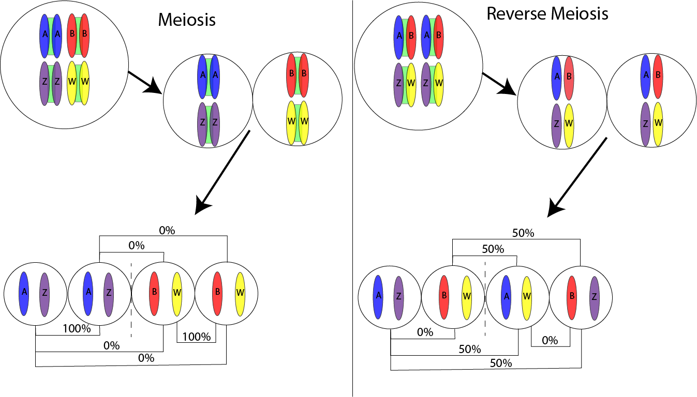

This diagram was in response to questions about why we believed that our butterfly might be a result of reverse meiosis rather than just standard meiosis. Here, I attempted to show the mechanical difference between meiosis and reverse meiosis, where the homologous chromosomes are the ones that pair during meiosis one. This also shows the final result and the genetic similarity between the maternal chromosomes in the resulting offspring. The conclusion should be that if the two sides maternal components are 0% related, or 25% of the total genetic material is related, then the most likely mechanism is reverse meiosis.
<br>

Sources: @Bogdanov2016, @Boman2024, @Cabral2014, and @Li2020


<br>
<br>
<br>


This diagram is in response to questions about if both mosaicism and chimerism could lead to gynandromorphism, and why we believe that it is more probably one than the other. The diagrams show the mechanisms of both mosaicism and chimerism, showing that mosaicism is the result of a nondisjunction event while chimerism results from the merging of seperate zygotes. The final pictures show that both mechanisms can result in either a gynandromorph or an individual of one sex, as well as the phenotypic and genotypic bases for favouring one mechanism to another. Phenotypically, it should make sense that the first guess for mechanism based upon having a bilateral gynandromorph would be chimerism due to the merging nature. We can then test that by looking to see if the two sides have two distinct genomes or whether they have one genome with an alteration.
<br>

Sources: @Conlin2010, @Fusco2023, and @Sahara2012
<br>
<br>
<br>

<div id="refs"></div>

```{r Session Information}
sessionInfo()
```

